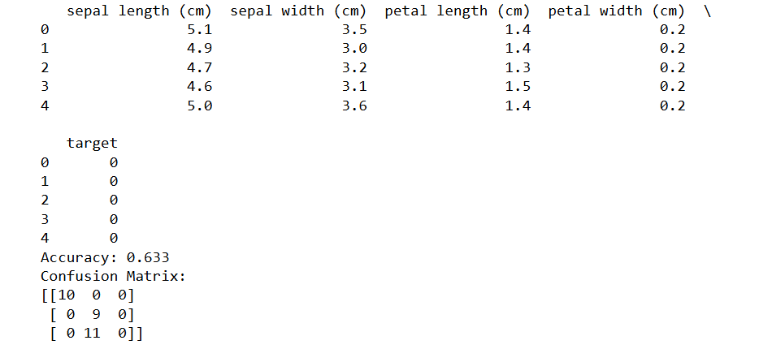

## AIM:
To write a program to predict the type of species of the Iris flower using the SGD Classifier.

## Equipments Required:
1. Hardware – PCs
2. Anaconda – Python 3.7 Installation / Jupyter notebook

## Algorithm
step 1. start

step 2. Import Necessary Libraries and Load Data

step 3. Split Dataset into Training and Testing Sets

step 4. Train the Model Using Stochastic Gradient Descent (SGD)

step 5. Make Predictions and Evaluate Accuracy

step 6. Generate Confusion Matrix

step 7. end

## Program:
/*
Program to implement the prediction of iris species using SGD Classifier.


Developed by: R suraj pandian


RegisterNumber:  212223080040
*/


```python


import pandas as pd
from sklearn.datasets import load_iris
from sklearn.linear_model import SGDClassifier
from sklearn.model_selection import train_test_split
from sklearn.metrics import accuracy_score, confusion_matrix
import matplotlib.pyplot as plt
import seaborn as sns

# Load the Iris dataset
iris = load_iris()

# Create a Pandas DataFrame
df = pd.DataFrame(data=iris.data, columns=iris.feature_names)
df['target'] = iris.target

# Display the first few rows of the dataset
print(df.head())

# Split the data into features (X) and target (y)
X = df.drop('target', axis=1)
y = df['target']

# Split the data into training and testing sets
X_train, X_test, y_train, y_test = train_test_split(X, y, test_size=0.2, random_state=42)

# Create an SGD classifier with default parameters
sgd_clf = SGDClassifier(max_iter=1000, tol=1e-3)

# Train the classifier on the training data
sgd_clf.fit(X_train, y_train)

# Make predictions on the testing data
y_pred = sgd_clf.predict(X_test)

# Evaluate the classifier's accuracy
accuracy = accuracy_score(y_test, y_pred)
print(f"Accuracy: {accuracy:.3f}")

# Calculate the confusion matrix
cm = confusion_matrix(y_test, y_pred)
print("Confusion Matrix:")
print(cm)

```

## Output:



## Result:
Thus, the program to implement the prediction of the Iris species using SGD Classifier is written and verified using Python programming.
